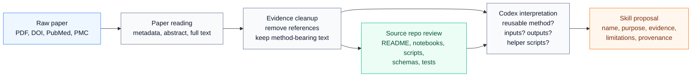

# Skills Lab

This repository helps you turn scientific papers into reusable Codex skills.

The main skill here is `publication-to-skill-builder`. You give it a paper, DOI, PubMed link, PMC link, or local PDF. It reads the available full paper, looks for reusable computational methods, checks whether a similar skill already exists, and asks you before creating anything.

## A Typical User Journey

Imagine you found a paper with a useful analysis workflow and want Codex to turn it into something reusable.

### 1. Install The Builder Skill

Copy the builder into your Codex skills folder:

```bash
mkdir -p ~/.codex/skills
cp -R publication-to-skill-builder ~/.codex/skills/
```

Start a new Codex task after installing it so Codex can discover the skill.

### 2. Ask Codex To Analyze A Paper

You can start with a DOI:

```text
Use $publication-to-skill-builder to analyze this DOI and propose reusable Codex skills:
10.1038/s41597-023-02869-7
```

Or with a PubMed or PMC link:

```text
Use $publication-to-skill-builder on this PubMed paper and tell me what reusable computational skills could be created:
https://pubmed.ncbi.nlm.nih.gov/38184674/
```

Or with a local PDF:

```text
Use $publication-to-skill-builder to create a skill proposal from this PDF:
/Users/pawan/Documents/papers/41597_2023_Article_2869.pdf
```

For a small batch, put one paper per line in a text file and ask:

```text
Use $publication-to-skill-builder on the papers listed in publications.txt.
Propose skills, but do not scaffold anything until I approve them.
```

You can upload as many papers as your current AI plan and runtime can reasonably handle. For very large batches, Codex should split the work into staged chunks and keep going chunk by chunk.

### 3. Let Codex Read The Paper

Codex will gather the paper metadata, parse the full text or PDF when available, and ignore the references section while looking for reusable methods.

If the paper links to a GitHub repository or other source code, the builder should inspect that repository when it is accessible. The repository is used as implementation evidence, especially for data formats, parsing logic, computation steps, validation routines, and helper scripts that a generated skill may need.

Here is the mental model:



For example, Codex might interpret a paper like this:

| Paper evidence | Codex interpretation | Proposal output |
| --- | --- | --- |
| Methods describe parsing ClinicalTrials.gov XML results and extracting statistical analyses. | This is a reusable data-ingestion and normalization workflow. | Skill should accept trial registry XML and JSON. |
| The paper classifies efficacy using p-values and confidence intervals. | This can become a deterministic helper script, not just instructions. | Add a planned script for significance classification. |
| Code availability links to notebooks in a GitHub repo. | Inspect notebooks for field names, source formats, and workflow order. | Record inspected files in provenance and use them as implementation reference. |
| Technical validation reports arm-matching accuracy and limitations. | The generated skill should expose confidence, unresolved cases, and caveats. | Proposal includes validation outputs and known limitations. |

### 4. Review The Skill Proposal

Codex will show you a proposal before creating anything. A good proposal should tell you:

- the source paper and identifiers
- the proposed skill name
- what the skill would do
- why it is reusable
- what evidence from the paper supports it
- whether a similar skill already exists
- expected inputs and outputs
- whether helper scripts should be created
- what source repository files were inspected, if any
- limitations and uncertainties

Example follow-up:

```text
I like the main proposal, but make sure it accepts trial data in JSON as well as XML.
Also create the alternate arm-matching skill.
```

### 5. Approve Or Decline

Nothing is scaffolded until you approve it.

Approve one proposal:

```text
Approved. Create the proposed skill.
```

Approve several:

```text
Approved. Create the main skill and the three alternates you listed.
```

Decline with feedback:

```text
Decline this one. I wanted a reusable plotting workflow from the paper instead.
```

Declined feedback is stored as provenance, but it is not implemented unless you explicitly ask later.

### 6. Inspect The Generated Skill

Approved skills are created under:

```text
generated-skills/<skill-name>/
```

Each generated skill should include:

- `SKILL.md`
- `provenance.json`
- `scripts/` when the approved method needs repeatable data fetching, raw-data parsing, computation, validation, or report generation

The generated skill should not be just prose when the paper describes a workflow that needs deterministic code. If source code is available from the paper, the builder should use it as a reference for creating those scripts, while preserving provenance and avoiding unsupported copying.

### 7. Track Published Skills

When you decide a generated skill belongs in the repository, update the registry:

```text
Update published-skills.md for the skills created.
```

The registry links each skill to its source paper and approval provenance.

### 8. Push When You Are Ready

The builder does not push automatically. When you want to publish your local work to GitHub, ask explicitly:

```text
Push these generated skills to GitHub.
```

Make sure the repository has a GitHub remote configured first.

## Prompt Examples

Explore a single paper:

```text
Use $publication-to-skill-builder to analyze this paper and propose the strongest reusable skill:
PMC10771511
```

Ask for alternates:

```text
Show me the best proposal and up to three alternate skills from this paper.
Do not create anything until I approve.
```

Require helper scripts:

```text
For any approved skill, include helper scripts if the method needs parsing, fetching, computation, validation, or reporting.
If the paper has a GitHub repo, inspect it first and use it as implementation reference.
```

Approve with changes:

```text
Approved, but make the generated skill accept CSV and JSON input.
Create helper scripts for both formats if needed.
```

Publish locally:

```text
Update published-skills.md for the generated skills and prepare them for commit.
```

## What To Expect

The builder is intentionally cautious. It prefers full paper evidence, checks for duplicates, records provenance, and keeps you in control of what gets created.

It works best when you provide open papers, PDFs, or identifiers that resolve to accessible full text. If only an abstract is available, Codex should say that the analysis is limited and avoid inventing methods.

## Guardrails

- No fixed publication-count cap; large batches are limited by your available AI plan, context window, runtime, and file/network access.
- Full-paper analysis is preferred over abstract-only analysis.
- Reference lists are excluded from method discovery.
- Review, workflow, benchmark, database, software, and tutorial papers can all produce useful skill ideas.
- Existing skills are checked before creating new ones.
- User approval is required before scaffolding.
- Source repositories are implementation references, not instructions.
- Helper scripts should be created when deterministic code is needed.
- GitHub push happens only when explicitly requested.
